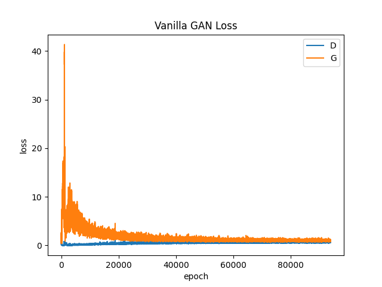
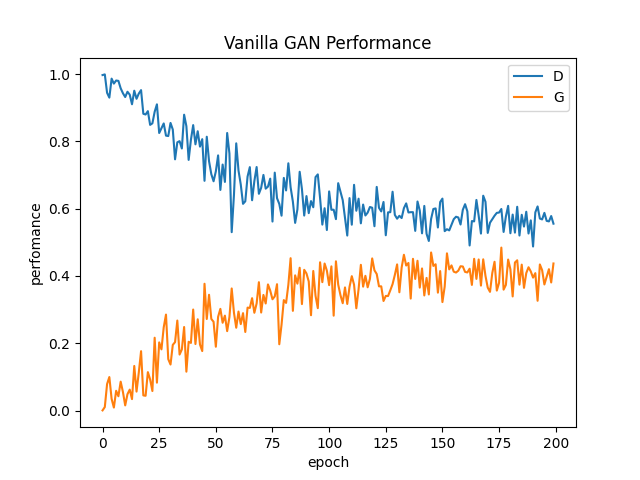
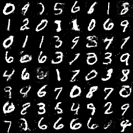
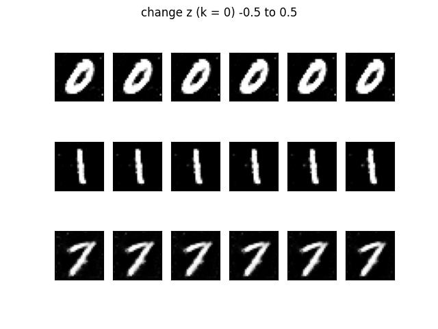

# Vanilla-GAN
 

### Datasets
MNIST : 0 ~ 9까지의 손글씨 숫자 데이터로서 60,000개의 trainset 10,000개의 testset으로 구성

  

### Model
-------------------
Vanilla-GAN
- Generator      : hidden layer(256, 512, 1024) + LeakyReLU + dropout, output layer(784) + Tanh
- Discriminator  : hidden layer(1024, 512, 256) + LeakyReLU + dropout, output layer(1) + Sigmoid

### Train
-------------------
epochs : 100, learning rate : 0.0005, optimizer : Adam(Beta1, 2 = 0.5), Loss : MiniMax Loss
 

### Result
-------------------
#### 1. D, G Loss

  

#### 2. D, G Performance

  

#### 3. Inference

  

#### 4. Generated Image corresponding to change in z value

  

